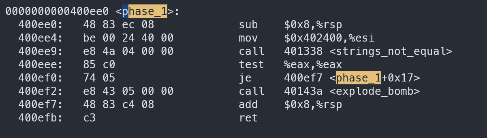
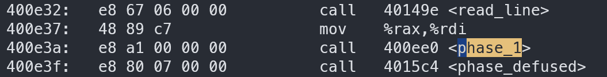
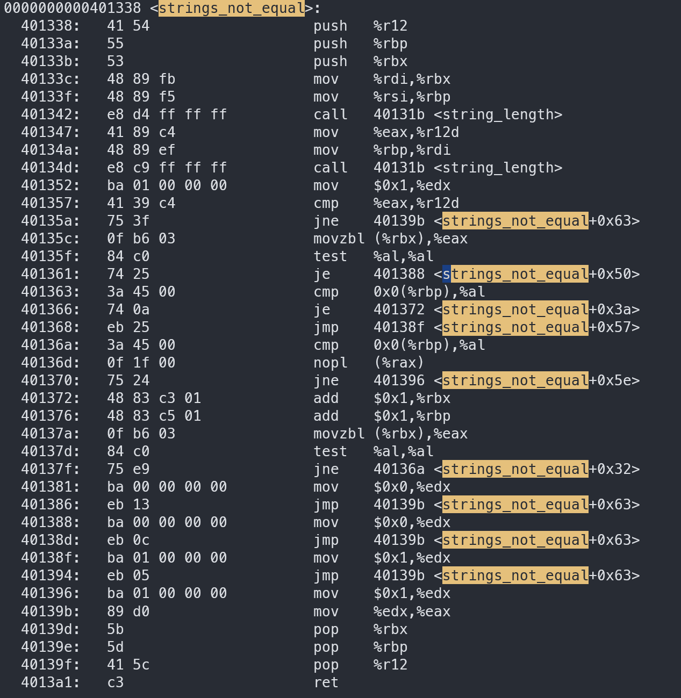
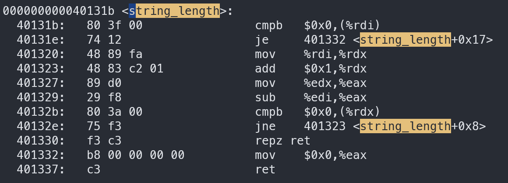

# Defuse process

Shell 1: gdb window
Shell 2: other tools (for example: objdump).

I used `objdump -d bomb > disassemble.txt`, and noticed that there are functions `main`, `phase_1` to `phase_6` and `secret_phase` (I guess that they are the phases that I need to solve), `fun7` (I don't know its usage so far), `explode_bomb` (I guess it's the function to make the bomb explode, so I need to add a break point at the entrance of this function to prevent explosion), and other functions.

Then I set break point at the entrance of `main`, `explode_bomb`, and each phase:
   `gdb bomb` -> `break main` -> `break explode_bomb` -> `break phase_1` to `break phase_6` -> `break secret_phase`.

## Defuse phase 1

Read the disassembled code of phase_1:

1. 0x400ee0: allocate space in stack
2. 0x400ee4: %esi = 0x402400 
3. 0x400ee9 to 0x400efb: call [strings_not_found](#function-strings_not_found) -> if string storing in (more precisely, "pointed by") `%rdi` and `%rsi` are different, **BOOM!**  If the same, return safely.

So, we need to find out strings pointed by `%rdi` and `%rsi`.  `%rsi` is pointing to address `0x402400`.  As for `%rdi` we have to check the instructions before `phase_1` is called. -> in vim `:/phase_1`, we get:

We see that `%rdi = %rax`, whereas `%rax` stores the result of function `read_line`. So `%rax` is the pointer pointing to the string we input.  

Thus, to defuse phase 1, we need to input the string located at 0x402400. Let's get it by `print (char *) 0x402400` in `gdb`. We get the answer: "**Border relations with Canada have never been better.**" (don't add double quotes in your answer).

## Function strings_not_found

**Effect:**  
  > First argument (string): a string  
  > Second argument (string): another string  
  > Return (bool): 1 if two strings are not equal; 0 if equal

- 401338 to 3b: store values in callee-saved registers in stack.
- 3c: `#rbx = %rdi` = first_argument
- 3f: `%rbp = %rsi` = second_argument
- 42: call [string_length](#function-string_length) -> `%eax` stores the length of string `%rdi` -> now we know that first_argument is a string.
- 47: `%r12d = %eax` = length of first_argument
- 4a: `%rdi = %rbp` = second_argument
- 4d: call [string_length](#function-string_length) -> now `%eax` stores the length of second_argument -> second_argument is also string.
- 52: `%edx = 0x1`
- 57 to 5a: if `%r12d != %eax` (lengths of first and second argument are not equal) goto 9b (restore callee-saved registers and then `return 1`); else go on
- 5c: move byte to long word (zero-extended). Fetch 1 Byte from address `M[R[%rbx]]` and place it into `%eax`. `%eax` (or `%al`) = a character of first_argument (string).
- 5f to 61: if that character is 0 ([ASCII No.0](#appendix) means end of string) -> if we reach the end of first_argument then goto 88 (assign `%edx = 0` then go back to 63); else go to 63 directly.
- 63 to 66: if (`%al == M[0x0 + R[%rbp]]`) go to 72; else go on (68: go to 8f (restore and `return 1`))
  > - 72 to 76: `%rbx` and `%rbp` point to the next character
  > - 7a: Fetch the character pointed by `%rbx` in the first_argument and store it in `%al`
  > - 7d to 7f: if that character is not `\0`, go to 6a; else (means that both we reach the end of both strings at the same time, and all characters before are the same) go to 9b (restore callee-saved registers and `return 0`)
  >> - 6a: compare `%al` with `M[0x0 + R[%rbp]]` (only line 0x40137f can jump to this line, so `%al` must not be 0)
  >> - 6d: do nothing
  >> - 70: if not equal, go to 96 (restore and `return 1`)

## Function string_length

**Effect:**
  > First argument (string): a string.  
  > Return (int): length of that string.

- 40131b and 1e: if (`M[R[%rdi]] == 0` ([ASCII No.0](#appendix) is `\0`: end of string)) goto 32 (0x401332); else go on;  first_argument (`%rdi`) should be a pointer pointing to the head of a string, if the string is empty, go to 32 (32 to 37: return 0)
- 20: `%rdx = %rdi` = first_argument (pointer to string's head)
- 23: `%rdx++` move the pointer to the next character
- 27: `%eax = %edx`
- 29: `%eax -= %edi` = current_pointer_position - initial_pointer_position
- 2b to 30: if `M[R[%rdi]] != \0` goto 23; else go on (return). If the pointer meets the end of string, `return length`

## Secret phase

check which function calls it: `vim disassemble` -> `:/secret_phase`. It is called by function `phase_defused`

## Appendix

1. find out the meaning of ASCII No.0: `ascii -d`, we know that No.0 is `NUL` -> `ascii NUL`, we know `NUL` is `\0`, which is the end-of-string character.
